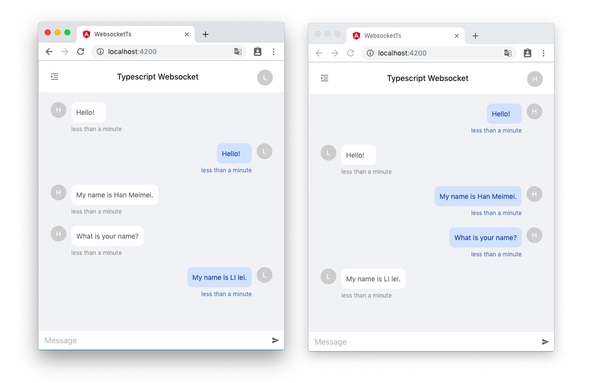

# Typescript Websocket

Type safety websocket message

## Development

1. Run `npm run build:server` to compile server.
2. Run `npm run serve:server` to start websocket server on `http://localhost:8080/ws`
3. Run `npm run start` to start front-server on `http://localhost:4200/`
